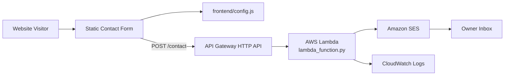

# Contact Form API

A serverless contact form solution for the McGinnis Architecture portfolio website. The frontend collects a visitor's information, sends the submission to an API Gateway HTTP endpoint, and uses Lambda to validate and forward the message through Amazon SES.

## What this project demonstrates

- Building a lightweight serverless backend for a static website
- Connecting a browser-based form to API Gateway
- Validating user input in Lambda
- Sending transactional-style email notifications with SES
- Using AWS SAM to define and deploy infrastructure as code
- Applying CORS restrictions for a public website origin

## AWS services used

| Service | Role |
| --- | --- |
| Amazon API Gateway HTTP API | Public endpoint for contact form submissions. |
| AWS Lambda | Validates request data and sends email through SES. |
| Amazon SES | Sends form submission notifications to the site owner. |
| AWS IAM | Grants Lambda permission to call SES. |
| Amazon CloudWatch Logs | Captures Lambda execution logs for troubleshooting. |

## Folder structure

```text
projects/contact-form-api/
├── README.md
├── frontend/
│   ├── index.html
│   ├── success.html
│   ├── script.js
│   └── config.js
├── backend/
│   ├── lambda_function.py
│   └── requirements.txt
├── infrastructure/
│   └── template.yaml
└── docs/
    └── architecture.mmd
```

## Architecture flow

1. A visitor submits the form from the static portfolio website.
2. The frontend JavaScript reads the API endpoint from `frontend/config.js`.
3. The browser sends a `POST` request to API Gateway.
4. API Gateway invokes the Lambda function.
5. Lambda validates the request, applies anti-spam checks, and sends an email through SES.
6. The browser redirects the visitor to the success page after a successful response.
7. CloudWatch Logs records function activity for troubleshooting.



## Deployment

From the infrastructure folder:

```bash
cd projects/contact-form-api/infrastructure
sam build
sam deploy --guided
```

During guided deployment, provide:

- `SiteOrigin` — the exact website origin allowed by CORS, such as `https://www.mcginnisarchitecture.com`
- `SesFromAddress` — a verified SES sender address or domain-based sender
- `SesToAddress` — the inbox that receives contact form submissions

After deployment, copy the `ContactApiEndpoint` output into `frontend/config.js`:

```js
window.APP_CONFIG = {
  apiEndpoint: "https://abc123xyz.execute-api.us-east-1.amazonaws.com/contact"
};
```

Then redeploy or re-upload the static website files.

## Local/browser testing

Use the browser's Network tab to confirm the form sends a `POST` request to the deployed API endpoint. For backend troubleshooting, review the Lambda logs in CloudWatch.

A basic API test can also be run with curl:

```bash
curl -i -X POST "https://abc123xyz.execute-api.us-east-1.amazonaws.com/contact" \
  -H "Content-Type: application/json" \
  -d '{"email":"you@example.com","consent":true}'
```

## Portfolio value

This project demonstrates a practical static-site integration pattern: a low-cost frontend hosted separately from a serverless backend that only runs when a visitor submits a form.
