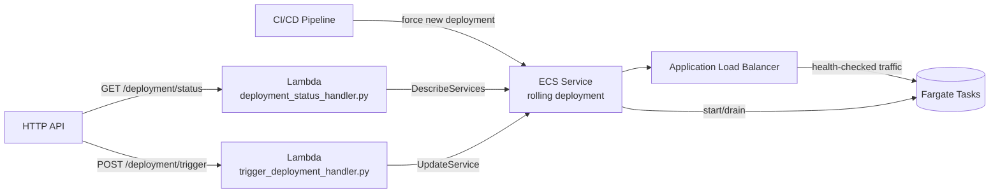

# Container Orchestration

This is a deliberate exception to this portfolio's usual pattern: the six
newest CDK-based projects skip a README because their real, deployed
backend is the documentation. This project has no live backend — its
architecture is fully designed and documented here instead, and its
`#demo` runs entirely in the browser. See "Why this isn't deployed" below.

An ECS Fargate service behind an Application Load Balancer, deployed via
CI/CD and rolled out with zero downtime using ECS's native rolling-update
deployment controller — one task starts, passes its health check, and only
then does an old task drain and stop, repeated until the whole service is
on the new task definition.

## What this demonstrates

- An ECS Fargate service behind an Application Load Balancer
- Zero-downtime rolling deployment via `minHealthyPercent`/`maxHealthyPercent`
- A deployment circuit breaker with automatic rollback on repeated failures
- ALB target-group health checks gating traffic to new tasks
- A small status API (real handlers, never wired to the live demo) for
  polling deployment progress without granting the frontend ECS IAM access

## AWS services used (if deployed)

| Service | Role |
| --- | --- |
| Amazon ECS (Fargate) | Runs the containerized service; owns the rolling-deployment sequence. |
| Application Load Balancer | Health-checks tasks and routes traffic only to healthy ones. |
| Amazon VPC | Two-AZ network with one NAT gateway for the Fargate tasks' outbound access. |
| AWS Lambda | Two small functions exposing deployment status/trigger over HTTP. |
| Amazon API Gateway (HTTP API) | Fronts the status Lambdas with CORS restricted to this site's origin. |
| Amazon CloudWatch | Container Insights and Lambda logs. |
| AWS IAM | Scopes each Lambda to exactly the one ECS API call it needs. |

## Folder structure

```text
projects/container-orchestration/
├── README.md
├── frontend/
│   ├── index.html
│   └── script.js
├── backend/
│   ├── deployment_status_handler.py
│   ├── trigger_deployment_handler.py
│   └── requirements.txt
└── homepage-card.html
```

The frontend maps to the deployed website path `/project/containers/`.
There is no `config.js` and no `fetch()`/XHR anywhere in `script.js` — the
`#demo` section's rolling deployment is a pure client-side animation.

## What deploying this would provision

`cdk/lib/container-orchestration-stack.ts` is a real, compilable CDK stack
that is **never imported by `cdk/bin/portfolio.ts`**, so `cdk deploy` can
never touch it. If it ever were instantiated, it would provision:

1. A 2-AZ VPC with a single NAT gateway.
2. An ECS cluster and an `ApplicationLoadBalancedFargateService` (task
   definition, Fargate service, and internet-facing ALB) running a public
   sample image, with `minHealthyPercent: 100` / `maxHealthyPercent: 200`
   and a deployment circuit breaker with rollback enabled.
3. Two Lambda functions (`deployment_status_handler.py`,
   `trigger_deployment_handler.py`) scoped via IAM to
   `ecs:DescribeServices` and `ecs:UpdateService` respectively, on this
   service's ARN only.
4. An HTTP API exposing `GET /deployment/status` and
   `POST /deployment/trigger`.



## Why this isn't deployed

A NAT Gateway (~$33/month) and Application Load Balancer (~$16/month) are
both flat hourly charges that run whether or not a single task ever
handles a request, and six small Fargate tasks running continuously add
another $25-40/month on top. All-in, this architecture costs roughly
**$75-200/month even fully idle** — a cost that isn't justified for a
portfolio demo, unlike this portfolio's other, pay-per-request projects
that scale to near-zero when nobody's using them. See the `#pricing`
section on this project's own page for the full cost breakdown.
