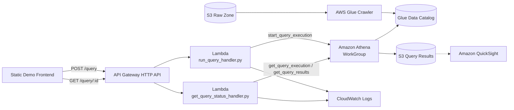

# Data Lake & Analytics

This project keeps a `README.md` where the six newest live projects in this portfolio deliberately don't — those skip it because their real, deployed backend is the documentation. This project has no live backend to click through (see "Why this isn't deployed" below), so this file is the primary place to see the intended architecture.

A serverless analytics pipeline pattern: raw data lands in an S3 "raw zone," AWS Glue crawls it into a Data Catalog, Amazon Athena runs serverless SQL directly against S3 using that catalog, and Amazon QuickSight would visualize the results. The live demo on this project's page runs entirely client-side against a small baked-in sample dataset — no AWS calls happen when you use it.

## What this demonstrates

- An S3-based data lake "raw zone" as the single source of truth
- AWS Glue crawling S3 objects into a Data Catalog database/table, so schema is inferred once and reused by every downstream query engine
- Amazon Athena running serverless SQL directly against S3 data via the Glue Data Catalog — no cluster to provision or manage
- An Athena workgroup to scope query result location and per-query data-scanned limits
- Amazon QuickSight as the visualization layer on top of Athena
- A Lambda-fronted API pattern for kicking off and polling an asynchronous Athena query (`start_query_execution` → poll → `get_query_results`)

## AWS services used

| Service | Role |
| --- | --- |
| Amazon S3 | Raw zone — the durable source of truth every other service reads from. |
| AWS Glue | Crawls the raw zone and maintains the Data Catalog database/table schema Athena queries against. |
| Amazon Athena | Runs serverless SQL against the Glue Data Catalog, scoped to a dedicated workgroup. |
| Amazon QuickSight | Visualizes Athena query results as dashboards (not provisioned by the CDK stack below — QuickSight is account-level and its per-seat licensing is exactly why this stays undeployed, see below). |
| AWS Lambda | Starts and polls Athena query executions on the API's behalf. |
| Amazon API Gateway HTTP API | Exposes `POST /query` and `GET /query/{id}` for the frontend. |
| Amazon CloudWatch Logs | Captures Lambda execution output. |

## Folder structure

```text
projects/data-lake-analytics/
├── README.md
├── frontend/
│   ├── index.html
│   └── script.js
└── backend/
    ├── run_query_handler.py
    ├── get_query_status_handler.py
    └── requirements.txt
```

The frontend maps to the deployed website path `/project/datalake/index.html`. There's no `config.js` here and no `infrastructure/` folder — the corresponding CDK stack lives at `cdk/lib/data-lake-analytics-stack.ts` but is never instantiated in `cdk/bin/portfolio.ts` (see below).

## Architecture flow (if deployed)



1. Source data is written to the S3 raw zone.
2. A Glue crawler periodically inspects the raw zone and updates the Data Catalog's database/table schema.
3. The frontend's "Run query" button (on the real, deployed version) would call `POST /query` with one of a few preset query ids.
4. `run_query_handler.py` maps that id to a real SQL string and calls Athena's `start_query_execution`, scoped to the dedicated workgroup, against the Glue Data Catalog table.
5. The frontend polls `GET /query/{id}`; `get_query_status_handler.py` calls `get_query_execution` until the query succeeds, then `get_query_results` and returns rows to the browser.
6. Athena writes its own result files to a dedicated S3 results prefix, which QuickSight (or any other BI tool) could read from directly.

## What deploying this would provision

`cdk/lib/data-lake-analytics-stack.ts` is a real, compilable CDK stack — it's `tsc`/`cdk synth`-checked like every other stack in this repo — but it is intentionally never imported or instantiated in `cdk/bin/portfolio.ts`, so `cdk deploy` can never touch it. If it ever were wired in, it would provision:

- An S3 bucket for the raw zone, and a second S3 bucket (or prefix) for Athena query results
- A Glue `CfnDatabase`, `CfnCrawler`, and `CfnTable` for the Data Catalog
- An Athena `CfnWorkGroup` scoped to the results bucket
- Two Lambda functions (`run_query_handler.py`, `get_query_status_handler.py`) and an HTTP API in front of them

QuickSight itself is deliberately left out of the CDK stack — it's an account-level service with its own per-seat licensing model rather than a resource you provision per-project, so including it wouldn't actually reflect how it'd really get set up.

## Why this isn't deployed

This AWS architecture is fully designed and documented above, but intentionally not deployed. Amazon QuickSight's per-seat licensing (~$9–24/user/month) and ongoing Glue crawler/job costs aren't justified for a portfolio demo that would otherwise sit idle — so instead, this page's demo runs entirely on a static, baked-in dataset with zero AWS calls, and the architecture that *would* back a real version stays here in code, fully compilable, ready to deploy if it were ever needed.

## Design note

The "queries" in the demo aren't a general SQL interface — they're a fixed set of 3 preset filters/aggregations over a small synthetic dataset, labeled as if they were canned Athena queries. This keeps the demo honest about what it's actually doing (client-side JS over static data) while still showing the shape of "pick a query, wait, see results" that the real Athena flow above would have.
