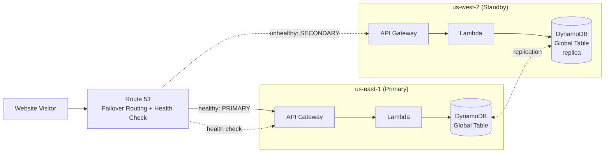

# Multi-Region Disaster Recovery

> **Reference build, not deployed.** The six most recent live projects in this repo skip a `README.md` because their real, deployed backend is the documentation — click the demo, watch the network tab, read the code. This project has no live backend to explore in its place, so this README (and its embedded diagram) is the primary place to see the intended architecture. See "Why this isn't deployed" below.

A reference architecture for AWS multi-region disaster recovery: how to keep a primary-region outage from becoming a full outage, at three different points on the cost-vs-recovery-time spectrum. The demo page simulates a region failover client-side — no AWS backend runs behind it.

## What this demonstrates

- The three common DR postures on the AWS Well-Architected reliability spectrum: **pilot light**, **warm standby**, and **active-active**
- Route 53 health-check-based failover routing (`PRIMARY`/`SECONDARY` record sets tied to a health check)
- The RPO/RTO tradeoff each posture makes, and what drives its idle-time cost
- DynamoDB Global Tables as the data-layer half of a real failover (so the standby region isn't just idle compute waiting for data it doesn't have)
- Why "just deploy to two regions" is a cost decision, not just an architecture decision

## AWS services used (as designed — see below for what's actually deployed)

| Service | Role |
| --- | --- |
| Amazon Route 53 | Health check against the primary region's endpoint, plus a failover routing policy (`PRIMARY`/`SECONDARY` record sets) that flips traffic to the standby region automatically. |
| AWS Lambda | Serves failover state to the demo page and (in a real deployment) would be the compute layer in both regions. |
| Amazon DynamoDB | Failover-state table; a real deployment would use a DynamoDB Global Table so both regions read/write the same replicated data. |
| Amazon API Gateway (HTTP API) | Exposes `GET /failover-state` and `POST /failover-state/simulate`. |
| Amazon CloudWatch | Backs the Route 53 health check's alarm state. |

## Architecture

## The three postures

| Posture | What's running in the standby region | Failover time | Idle-time cost |
| --- | --- | --- | --- |
| **Pilot light** | Just the data layer replicated (DynamoDB Global Table); compute is deployed but scaled to zero/minimal | Minutes — compute needs to scale up | Lowest — you're mostly only paying for replicated storage |
| **Warm standby** | A scaled-down but fully running copy of the stack, ready to take load immediately | Seconds to low minutes — just a traffic cutover | Moderate — a permanently running (if small) second stack |
| **Active-active** | A full-scale, fully running copy actively serving a share of production traffic | Near-zero — it's already serving traffic | Highest — two full production stacks, all the time |

## Why this isn't deployed

Running any of these three postures for real means paying for infrastructure in a second AWS region continuously, whether or not a failover ever happens — that's the entire point of DR, and also exactly why it's expensive. Realistic idle-time costs:

- **Pilot light**: mostly DynamoDB Global Table replication + a minimal standby Lambda/API footprint — roughly **$5–30/month**, the cheapest posture by design.
- **Warm standby**: a permanently running, right-sized second-region stack — roughly **$50–150/month** even serving zero real traffic.
- **Active-active**: two full-scale production stacks — **$150–500+/month**, scaling with whatever the primary region already costs, doubled.

None of that is justified for a portfolio demo that exists to show the pattern, not to actually protect a production workload. The demo page simulates the failover sequence and posture differences entirely in the browser instead.

## What deploying this would provision

`cdk/lib/multi-region-dr-stack.ts` is real, compilable CDK — type-checked by `tsc`/`cdk synth` like any other stack in this repo — but is **never imported by `cdk/bin/portfolio.ts`**, so `cdk deploy` can never touch it. If it were wired in, it would provision, per stage:

- A DynamoDB table (`FailoverStateTable`) holding the current simulated failover state
- A Route 53 health check against the primary region's API endpoint
- Two Lambda functions (`get_failover_state_handler.py`, `trigger_failover_handler.py`) behind an HTTP API
- `PRIMARY`/`SECONDARY` Route 53 failover record sets pointing at the two regions' API endpoints

## Design note

The demo intentionally doesn't fake a real DynamoDB Global Table replication lag or a real Route 53 health-check propagation delay (typically 30–90 seconds in practice) — the client-side sequence (`DETECTING` → `FAILING_OVER` → `PROMOTED` → `SERVING`) is compressed to a few seconds so the pattern is legible without asking a visitor to wait around for realism that wouldn't add anything they couldn't already read in the table above.
