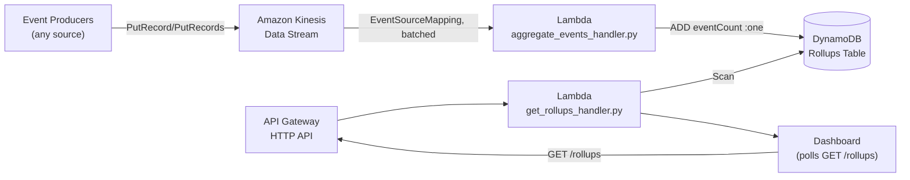

# Real-Time Operations Dashboard

This project keeps a `README.md` where the six newest live projects in this portfolio (`workflow-visualizer` onward) deliberately don't — those skip it because their real, deployed backend and demo page already serve as the documentation. This project has no deployed backend at all (see "Why this isn't deployed" below), so this file is the primary place to see the intended architecture.

A reference architecture for a real-time operations/observability dashboard: Kinesis Data Streams ingests a continuous flow of events, a Lambda consumer aggregates them into DynamoDB rollup counters, and an HTTP API serves those rollups to a dashboard that polls it. The live project page's demo runs the same shape entirely in the browser — a simulated event stream feeding two hand-rolled SVG charts — with zero network calls.

## What this demonstrates

- Kinesis Data Streams as an ordered, replayable ingestion layer
- A Lambda `EventSourceMapping` consumer processing batched stream records
- Atomic DynamoDB counter updates (`ADD`) to avoid lost updates under concurrent batch processing
- Partial batch failure reporting (`reportBatchItemFailures`) so one bad record doesn't fail an entire batch
- An unauthenticated read API for a polling dashboard client
- Kinesis is the one AWS service this portfolio's other projects — the 9 live ones and the other 4 reference-only builds — don't otherwise demonstrate

## AWS services used

| Service | Role |
| --- | --- |
| Amazon Kinesis Data Streams | Ordered ingestion of events from any number of producers. |
| AWS Lambda | Aggregates batches of stream records into DynamoDB counters; serves the read API. |
| Amazon DynamoDB | Stores one rollup item per region with an atomically-incremented event count. |
| Amazon API Gateway HTTP API | Exposes `GET /rollups` for the dashboard to poll. |
| AWS IAM | Grants each function access only to the resources its role needs. |
| Amazon CloudWatch Logs | Captures Lambda execution output. |

## Folder structure

```text
projects/realtime-ops-dashboard/
├── README.md
├── frontend/
│   ├── index.html
│   └── script.js
└── backend/
    ├── aggregate_events_handler.py
    ├── get_rollups_handler.py
    └── requirements.txt
```

The frontend files map to the deployed website path `/project/opsdash/` (beta only — see below). There's no `config.js` and no `infrastructure/` directory: the frontend makes zero network calls, and the infrastructure lives entirely in `cdk/lib/realtime-ops-dashboard-stack.ts` rather than a separate SAM template, matching how every CDK-based project in this repo (not just the reference-only ones) is built.

## Architecture flow

1. Any number of producers call `PutRecord`/`PutRecords` against the Kinesis Data Stream with a small JSON event.
2. A Lambda `EventSourceMapping` invokes the aggregation function with a batch of records at a time.
3. The function base64-decodes and parses each record, then applies an atomic `ADD` update to that region's DynamoDB counter — never a read-modify-write cycle, so concurrent batches (this function scales out per-shard) can't clobber each other's counts.
4. The dashboard polls `GET /rollups` through API Gateway; a Lambda scans the (small, one-row-per-region) rollups table and returns current counts as JSON.
5. The dashboard redraws its charts from the response.



## What deploying this would provision

`cdk/lib/realtime-ops-dashboard-stack.ts` is real, compilable CDK — checked by `tsc`/`cdk synth` in this repo's build — but is never imported into `cdk/bin/portfolio.ts`, so it can never actually deploy. If it were instantiated, it would provision:

- A single-shard `kinesis.Stream` (`shardCount: 1`, 24-hour retention)
- A DynamoDB table (`region` as partition key, on-demand billing)
- `aggregate_events_handler.py` as a Lambda subscribed to the stream via `KinesisEventSource` (batched, with `reportBatchItemFailures` and retry limits configured)
- `get_rollups_handler.py` as a Lambda behind an HTTP API's `GET /rollups` route
- The same per-stage naming/origin/removal-policy conventions used by every other stack in this repo (`realtime-ops-dashboard` for prod, `realtime-ops-dashboard-beta` for beta — though in practice neither is ever created)

## Why this isn't deployed

Kinesis Data Streams bills per shard-hour regardless of traffic — about $0.015/hour, or roughly $15–20/month for a single shard once the small per-record PUT payload charge is added, even sitting completely idle. That's a real, continuous cost for infrastructure that would spend nearly all its time doing nothing in a portfolio context, so this project stays a documented reference architecture instead. The live page's demo reproduces the dashboard experience honestly — a simulated event stream, hand-rolled SVG charts, zero backend — without pretending infrastructure is running that isn't.
