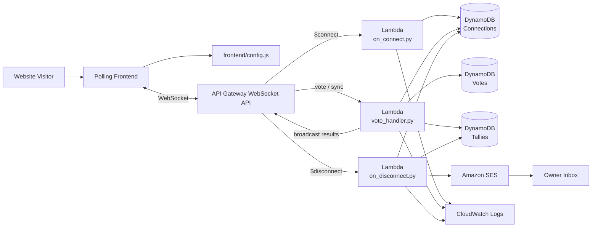

# Real-Time Polling App

A serverless real-time polling application for the McGinnis Architecture portfolio. Users connect through a WebSocket API, submit votes, receive synchronized poll updates, and trigger owner notifications through Amazon SES.

## What this project demonstrates

- Building real-time browser interaction with API Gateway WebSockets
- Routing WebSocket actions to separate Lambda handlers
- Persisting connection, vote, and tally data in DynamoDB
- Broadcasting updates to connected clients
- Sending owner notifications with SES
- Deploying WebSocket infrastructure with AWS SAM and CloudFormation resources

## AWS services used

| Service | Role |
| --- | --- |
| Amazon API Gateway WebSocket API | Maintains client connections and routes `$connect`, `$disconnect`, `vote`, and `sync` actions. |
| AWS Lambda | Handles connection lifecycle events, vote submissions, synchronization, and notifications. |
| Amazon DynamoDB | Stores active connections, individual votes, and aggregate tallies. |
| Amazon SES | Sends owner notification emails. |
| AWS IAM | Grants least-necessary access to DynamoDB, SES, and WebSocket connection management. |
| Amazon CloudWatch Logs | Captures execution logs for the Lambda functions. |

## Folder structure

```text
projects/realtime-polling-app/
├── README.md
├── frontend/
│   ├── index.html
│   ├── script.js
│   └── config.js
├── backend/
│   ├── vote_handler.py
│   ├── on_connect.py
│   ├── on_disconnect.py
│   ├── email_utils.py
│   └── requirements.txt
├── infrastructure/
│   └── template.yaml
└── docs/
    └── architecture.mmd
```

## Architecture flow

1. A visitor opens the polling page from the static website.
2. The frontend reads the WebSocket endpoint from `frontend/config.js`.
3. The browser connects to API Gateway WebSocket API.
4. The `$connect` route invokes `on_connect.py`, which records the connection in DynamoDB.
5. The client sends a `sync` action to retrieve current results.
6. When a visitor votes, the `vote` route invokes `vote_handler.py`.
7. Lambda stores the vote, updates tallies, and broadcasts current results to active connections.
8. When a user disconnects, `$disconnect` invokes `on_disconnect.py`, removes the connection, and sends an owner notification through SES.



## Deployment

From the infrastructure folder:

```bash
cd projects/realtime-polling-app/infrastructure
sam build
sam deploy --guided
```

During guided deployment, provide:

- `SesFromAddress` — a verified SES sender address or domain-based sender
- `SesToAddress` — the inbox that receives polling notifications
- `SiteBaseUrl` — the portfolio website base URL
- `StageName` — the WebSocket API stage, usually `prod`

After deployment, copy the `PollWebSocketUrl` output into `frontend/config.js`:

```js
window.APP_CONFIG = {
  pollWsUrl: "wss://abc123xyz.execute-api.us-east-1.amazonaws.com/prod"
};
```

Then redeploy or re-upload the static frontend files.

## Testing

Open the polling page in two browser windows. Cast a vote in one window and confirm that both windows update with the latest totals. Then close a browser tab and confirm the disconnect handler removes the connection and sends the configured notification email.

## Portfolio value

This project demonstrates a more advanced serverless pattern than a basic request-response API. It shows how to manage state, real-time communication, multiple Lambda handlers, DynamoDB data models, and outbound notifications in a cohesive AWS solution.
