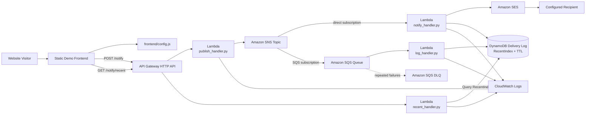

# SNS Notification Fan-Out

A live event-driven AWS demonstration in which one browser request publishes a message to Amazon SNS and the topic fans that event out to two independent subscribers. One branch invokes Lambda directly and sends an email through Amazon SES; the other passes through Amazon SQS before Lambda records the delivery in DynamoDB. A read API returns recent delivery status to the webpage.

## What this project demonstrates

- Publishing an event from API Gateway and Lambda to Amazon SNS
- Fan-out to subscribers with different delivery characteristics
- Direct SNS-to-Lambda invocation for low-latency processing
- SNS-to-SQS delivery for buffering, retries, and failure isolation
- An SQS dead-letter queue after repeated processing failures
- Independent DynamoDB writes from decoupled consumers
- A Global Secondary Index for reliable newest-first queries
- DynamoDB TTL for automatic cleanup of demonstration data
- Browser polling for short-lived asynchronous status updates
- API Gateway throttling for a public, unauthenticated demonstration endpoint
- Infrastructure as code with AWS SAM

## AWS services used

| Service | Role |
| --- | --- |
| Amazon API Gateway HTTP API | Exposes `POST /notify` and `GET /notify/recent`, enforces CORS, and applies route throttling. |
| AWS Lambda | Publishes messages, processes both fan-out branches, sends email, and returns recent delivery results. |
| Amazon SNS | Receives one published message and delivers it to multiple independent subscribers. |
| Amazon SQS | Buffers the logger branch, retries failed processing, and sends repeatedly failing messages to a dead-letter queue. |
| Amazon DynamoDB | Stores one row per subscriber and exposes a newest-first `RecentIndex` GSI. |
| Amazon SES | Sends the notifier branch's demonstration email to a configured recipient. |
| AWS IAM | Grants each function access only to the services required by its role. |
| Amazon CloudWatch Logs | Captures Lambda execution output for monitoring and troubleshooting. |

## Folder structure

```text
projects/sns-notification-fan-out/
├── README.md
├── frontend/
│   ├── index.html
│   ├── script.js
│   └── config.js
├── backend/
│   ├── publish_handler.py
│   ├── notify_handler.py
│   ├── log_handler.py
│   ├── recent_handler.py
│   └── requirements.txt
├── infrastructure/
│   └── template.yaml
└── docs/
    └── architecture.mmd
```

The frontend files map to the deployed website path `/project/fanningsns/`. The infrastructure template uses `CodeUri: ../backend/` to package the separated Lambda source directory.

## Architecture flow

1. A visitor loads the static project page and clicks the notification button.
2. The browser calls `POST /notify` through API Gateway.
3. `publish_handler.py` creates a client-correlated message ID and publishes one event to SNS.
4. SNS delivers the event to both subscribers independently.
5. The direct subscriber invokes `notify_handler.py`, which sends an SES email and records its result in DynamoDB.
6. The buffered subscriber places the event on SQS. `log_handler.py` consumes the queue message and records its result in DynamoDB.
7. Failed SQS deliveries are retried and eventually routed to a dead-letter queue after the configured receive limit.
8. The browser polls `GET /notify/recent`; `recent_handler.py` queries the DynamoDB `RecentIndex` GSI and groups subscriber rows by message ID.
9. The webpage displays completion status for both fan-out branches.



## Prerequisites

- An AWS account
- AWS SAM CLI installed locally
- An SES-verified sender identity
- A verified recipient too when the SES account is still in sandbox mode
- The exact website origin to allow through API Gateway CORS

## Deployment

From the infrastructure directory:

```bash
cd projects/sns-notification-fan-out/infrastructure
sam build
sam deploy --guided
```

Provide these parameters during guided deployment:

- `SiteOrigin` — the exact static-site origin, without a trailing slash
- `AdminEmail` — the SES-verified sender address
- `SnsToEmail` — the address that receives the demonstration message

After deployment, copy the `NotifyApiEndpoint` stack output into `frontend/config.js`:

```js
window.APP_CONFIG = {
  apiBase: "https://abc123xyz.execute-api.us-east-1.amazonaws.com",
  apiKey: "",
  headers: {},
  requestTimeoutMs: 10000,
  firstPollDelayMs: 1500,
  pollIntervalMs: 2500,
  maxPolls: 30
};
```

Anything stored in a browser-side configuration file is public. Do not place AWS credentials or other secrets in `config.js`.

## API testing

Trigger a notification:

```bash
curl -i -X POST "https://abc123xyz.execute-api.us-east-1.amazonaws.com/notify" \
  -H "Content-Type: application/json" \
  -d '{"note":"manual test"}'
```

Read recent delivery state:

```bash
curl -s "https://abc123xyz.execute-api.us-east-1.amazonaws.com/notify/recent"
```

A successful message should appear with both `logger` and `notifier` set to `true` after both asynchronous branches complete.

## Reliability and cost controls

- API Gateway limits the public routes to 5 requests per second with a burst limit of 10.
- The SQS consumer retries failed messages and sends repeated failures to a dead-letter queue after three receives.
- DynamoDB rows expire after 24 hours through TTL.
- The read function uses a sorted GSI rather than a table scan, ensuring it returns the actual newest records.
- All compute and messaging components are serverless and scale from zero usage.

## Design note

The page does not collect a visitor email address. The SES subscriber always sends to a fixed, configured recipient. This keeps the demonstration focused on SNS fan-out behavior rather than presenting a dynamic subscription workflow that the architecture does not implement.
