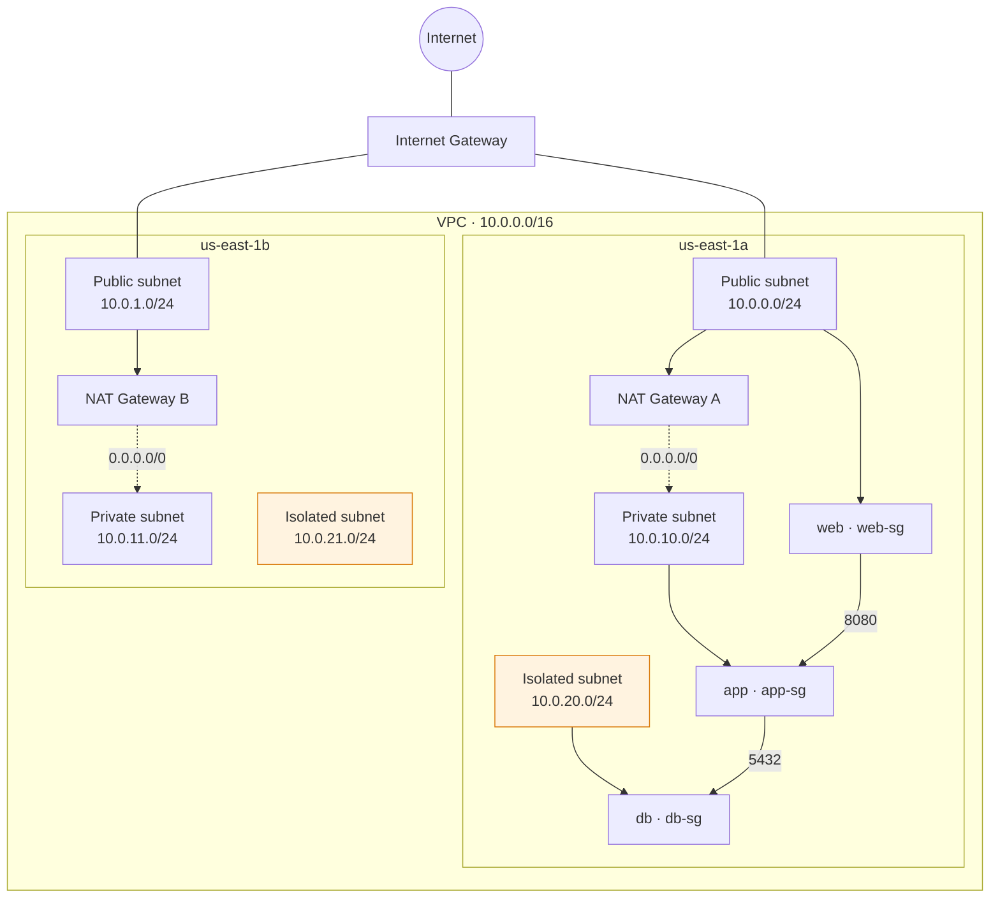

# VPC Network Design

**A deliberate exception to this portfolio's newest-project convention:** the six most recently added projects (`workflow-visualizer` onward) skip a `README.md` because their real, deployed backend is the documentation. This project has no live backend at all — it's reference-only, described below — so this README, not a running demo, is the primary place to see the intended architecture.

A multi-tier Amazon VPC — public, private, and isolated subnets duplicated across two Availability Zones, one NAT Gateway per AZ, and security groups that enforce tier-to-tier access by group reference rather than by IP range. The live demo page (`/project/vpc/index.html`) renders this exact topology as a clickable diagram: click any subnet or resource to inspect its actual route table or security group rules.

## What this demonstrates

- A three-tier subnet design — public, private-with-egress, isolated — expressed as explicit CDK `subnetConfiguration`, not the implicit default layout
- Per-AZ NAT Gateways for outbound internet access from private subnets, without routing across an AZ boundary
- Isolated subnets with no route to or from the internet at all, for workloads (e.g. a database tier) that must never be internet-reachable
- Security groups referencing other security groups by id, not by CIDR block, so tier-to-tier access stays correct even as the underlying subnet layout changes
- The RPO/RTO-adjacent tradeoff of choosing 2 NAT Gateways (higher availability, higher cost) over 1 shared gateway (lower cost, an AZ-crossing single point of failure)

## Why this isn't deployed

A NAT Gateway bills by the hour whether or not any traffic crosses it — roughly $0.045/hour (~$32.85/month) per gateway, plus ~$0.045/GB processed. This design uses two (one per AZ), so the networking layer alone runs **~$35–90/month**, before adding a single EC2 instance, load balancer, or database on top of it. That's not justified for a portfolio demo that's idle between visits, so this stack is real, compilable CDK — but it's never imported into `cdk/bin/portfolio.ts`, and `cdk deploy` can never touch it as a result.

## AWS services used

| Service | Role |
| --- | --- |
| Amazon VPC | The network boundary — `10.0.0.0/16`, spanning two AZs |
| Subnets (public / private / isolated) | Three tiers of network isolation, one of each per AZ |
| NAT Gateway | Outbound-only internet access for the private tier, one per AZ |
| Internet Gateway | Inbound/outbound internet access for the public tier |
| Route tables | Per-tier routing — public routes to the IGW, private routes to its AZ's NAT Gateway, isolated has no default route |
| Security groups | Stateful, tier-to-tier firewalls referenced by group id |

## Folder structure

```text
projects/vpc-network-design/
├── README.md
├── frontend/
│   ├── index.html
│   └── script.js
└── homepage-card.html
```

No `backend/` directory — this demo is pure static click-to-inspect, with zero API calls in either direction, so there's no Lambda handler to write. The frontend files map to the deployed website path `/project/vpc/`.

## What deploying this would provision

`cdk/lib/vpc-network-design-stack.ts` provisions:

- One `ec2.Vpc` (`10.0.0.0/16`, `maxAzs: 2`) with explicit `subnetConfiguration` for the `public` (`/24`), `private` (`PRIVATE_WITH_EGRESS`, `/24`), and `isolated` (`PRIVATE_ISOLATED`, `/24`) tiers
- `natGateways: 2` — one per AZ, each in that AZ's public subnet
- Three `ec2.SecurityGroup`s (`web-sg`, `app-sg`, `db-sg`), each only accepting inbound traffic from the tier directly upstream of it, by security group reference

No API Gateway, no Lambda, no `apiEndpoint` — unlike this portfolio's other backend-having reference stacks, there's genuinely nothing to expose over HTTP here. `cdk/lib/website-content.ts`'s `PROJECTS` entry for this project has no `key`, so nothing ever tries to look one up.



## Design decisions

**Reference-only, deliberately never deployed.** See "Why this isn't deployed" above. The stack file is `tsc`/`cdk synth`-checked as part of this repo's normal build, so it stays real, compilable code — never dead pseudo-code that's drifted out of sync with the diagram it's supposed to represent.

**Click-to-inspect, not autoplay.** This portfolio's other reference-only projects animate a sequence over time, because what they demonstrate *is* a sequence (a failover, a rolling deployment). A VPC's value is its static topology, so this page has no timers — you inspect it the way you'd inspect a real VPC in the AWS console, by clicking on things.

**One NAT Gateway per AZ, not one shared gateway.** This roughly doubles the NAT cost shown above versus a single shared gateway, but it's the higher-availability, more production-realistic default — a shared gateway is a valid cost optimization for a lower-availability workload, but this reference is meant to show the pattern most SAA-level designs actually recommend.

**Security groups referenced by group, not by CIDR.** A CIDR-based rule stays correct only as long as a resource's subnet doesn't change; a group-reference rule stays correct even if the underlying subnet layout is redesigned entirely, which is the more common source of drift in practice.
